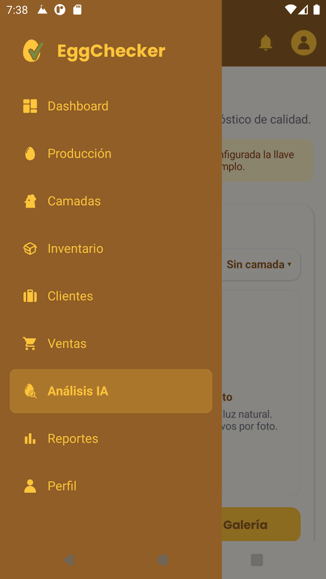
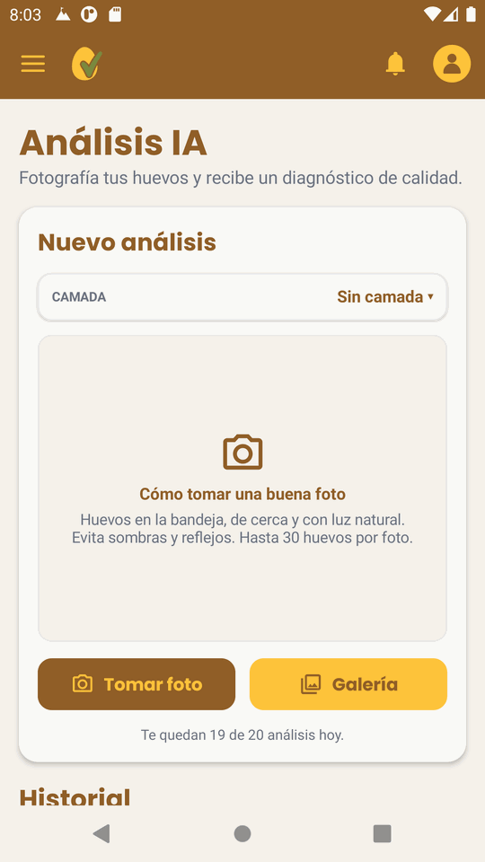
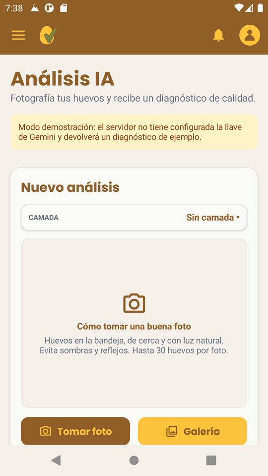
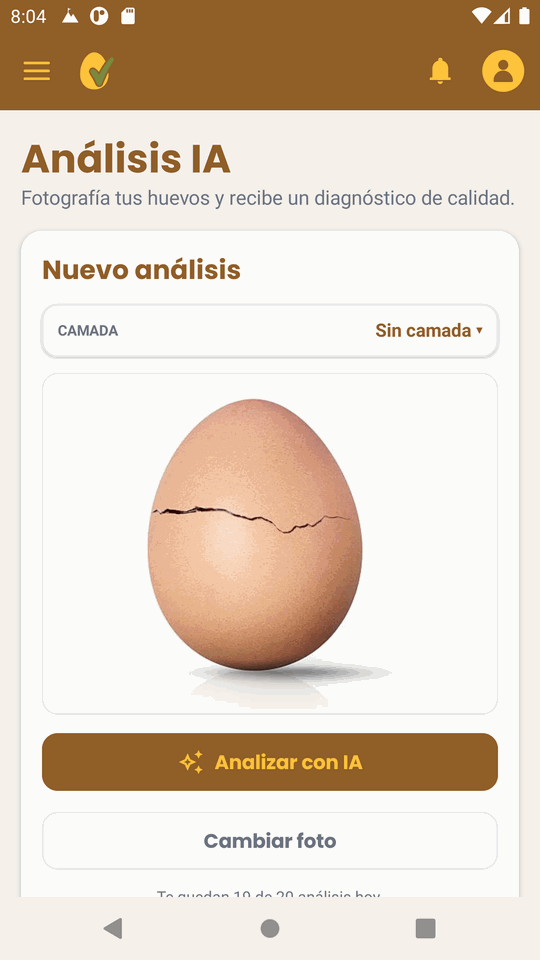
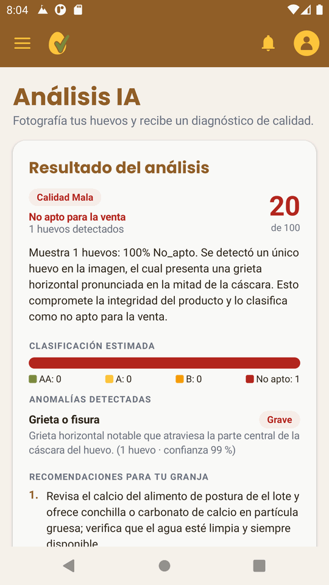
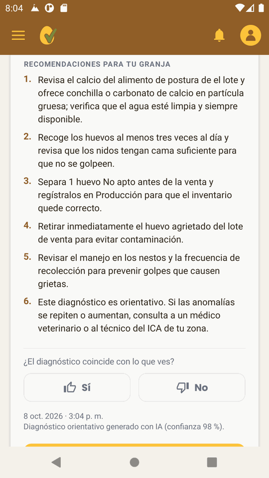
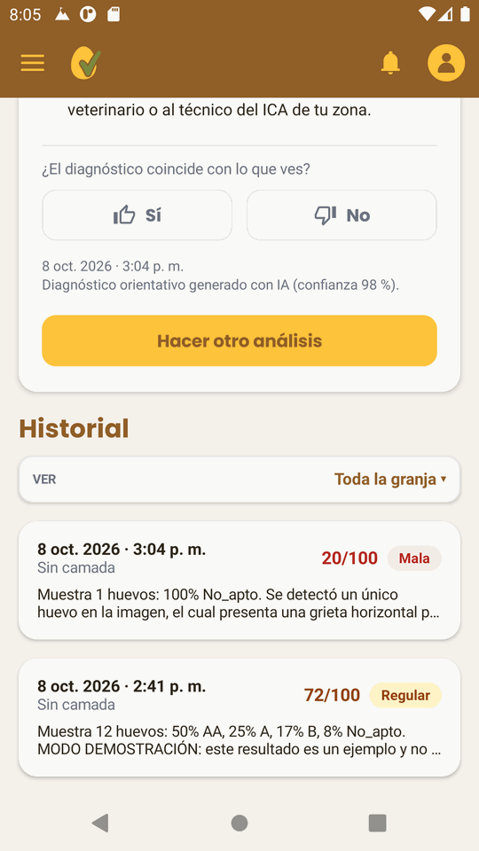

# Guía de uso: Análisis IA

El módulo **Análisis IA** permite que un avicultor con plan **Premium** fotografíe sus huevos y reciba un diagnóstico de calidad: anomalías detectadas, clasificación por tipo (AA, A, B, No apto), recomendaciones para su granja e historial por camada. Cubre los requisitos **RF-33 a RF-36** y el caso de uso **CU-06**.

Las capturas son de la app Android en el emulador. La versión web (`/analisis`) tiene el mismo flujo.

---

## Antes de empezar

| Requisito | Detalle |
|---|---|
| Plan | Usuario **Premium**. El plan gratuito ve un aviso de *Función Premium*. |
| Backend | `uvicorn app.main:app --reload` en `app/backend`. |
| Llave de IA | `GEMINI_API_KEY` en `app/backend/.env`. Es gratuita en [Google AI Studio](https://aistudio.google.com/apikey). Sin llave, el módulo funciona en **modo demostración**. |
| Emulador | `adb reverse tcp:8000 tcp:8000` para que la app llegue al backend local. |

---

## Paso 1. Abrir el módulo

Abra el menú **☰** y toque **Análisis IA**.

---

## Paso 2. Revisar la pantalla de nuevo análisis

La tarjeta **Nuevo análisis** muestra:

- **Camada**: el lote al que pertenecen los huevos. Si elige una, el análisis queda en el historial de esa camada (RF-36).
- **Consejos para la foto**: huevos en la bandeja, de cerca, con luz natural, sin sombras ni reflejos y hasta 30 huevos por foto.
- **Tomar foto** abre la cámara y **Galería** permite elegir una imagen guardada (RF-33).
- **Cupo del día**: cuántos análisis quedan, 20 por usuario al día por defecto, para cuidar el cupo gratuito de la API.

> **Modo demostración.** Si el servidor no tiene `GEMINI_API_KEY`, aparece un aviso amarillo y el resultado es siempre un ejemplo fijo que **no analiza la foto**. Sirve para probar el flujo sin internet. Para el análisis real, configure la llave y reinicie el backend.
>
> 

---

## Paso 3. Elegir la foto y analizar

Después de tomar o elegir la foto, aparece la vista previa. La app corrige la orientación y la reduce a 1280 px antes de enviarla.

- **Analizar con IA** envía la foto al servidor. Tarda entre 5 y 20 segundos.
- **Cambiar foto** permite elegir otra.

---

## Paso 4. Leer el diagnóstico

El resultado (RF-34) incluye:

| Elemento | Qué indica |
|---|---|
| **Calidad** | Buena, Regular o Mala. |
| **Puntaje** | De 0 a 100. |
| **Apto / No apto para la venta** | Si el lote se puede vender después de separar los huevos No apto. |
| **Resumen** | Cuántos huevos se detectaron y qué se observó. |
| **Clasificación estimada** | Barra con la cantidad de huevos AA, A, B y No apto. |
| **Anomalías detectadas** | Tipo (grieta, suciedad, deformidad…), gravedad (leve, moderada, grave), huevos afectados y confianza. |

En el ejemplo, la IA detectó **1 huevo** con una **grieta grave (confianza 99 %)**: calidad **Mala**, **20/100** y **No apto para la venta**.

---

## Paso 5. Revisar las recomendaciones y calificar el diagnóstico

Las **recomendaciones para tu granja** (RF-35) combinan dos fuentes:

1. **Reglas de EggChecker**, que cruzan las anomalías con los datos de la camada. Por ejemplo: calcio y vitamina D3 si hay grietas en aves mayores de 60 semanas, limpieza de nidos si hay suciedad, o revisión de la postura de los últimos 7 días.
2. **Sugerencias de la IA** sobre lo que se ve en la foto.

La última recomendación recuerda que el diagnóstico es **orientativo** y que, si las anomalías se repiten, se debe consultar a un médico veterinario o al técnico del ICA.

Con **Sí / No** el avicultor indica si el diagnóstico coincide con lo que ve. Esa calificación se guarda y servirá para entrenar más adelante un modelo propio.

---

## Paso 6. Consultar el historial

Cada análisis queda guardado (RF-36). En **Historial** se puede:

- Filtrar con **Ver** por camada o ver **Toda la granja**.
- Ver fecha, camada, puntaje y calidad de cada análisis.
- Tocar un análisis para abrir el detalle con la foto, calificarlo o eliminarlo.

---

## Limitaciones

- Una foto de celular **no detecta microgrietas ni manchas internas**: la industria usa sensores acústicos y ovoscopio para eso.
- En el plan gratuito de Gemini, Google puede usar las imágenes para mejorar sus modelos. Fotografíe solo huevos, sin personas ni datos personales.
- Las recomendaciones de manejo son generales. Valídelas con un médico veterinario.

## Archivos del módulo

| Capa | Archivos |
|---|---|
| Backend | `app/backend/app/api/analisis_ia.py`, `services/analisis_ia_service.py`, `services/ia_proveedor.py`, `services/recomendaciones_ia.py` |
| Android | `app/android/.../ui/analisis/`, `data/repository/AnalisisRepository.kt`, `data/storage/FotoAnalisisStorage.kt` |
| Web | `app/frontend/src/pages/AnalisisIA.jsx`, `components/analisis/`, `hooks/useAnalisisIA.js` |
| Pruebas | `app/backend/tests/test_analisis_ia.py` |
